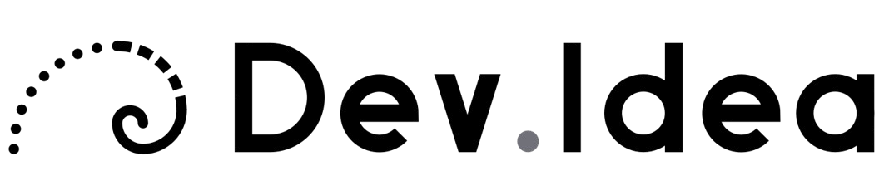

<div align="center">



# Dev.Idea

**Lienzo interactivo de toma de decisiones técnicas para desarrolladores.**
Transforma una idea difusa en un _blueprint_ técnico ejecutable, paso a paso y sin sobrecarga cognitiva.

<br />

[](https://nextjs.org)
[](https://tailwindcss.com)
[](https://ai.google.dev)
[](https://github.com/pmndrs/zustand)
[](https://pnpm.io)
[](#-licencia)

<br />

[Características](#-qué-es-devidea) ·
[Estaciones](#️-mapa-de-estaciones) ·
[Stack](#️-stack-tecnológico) ·
[Estructura](#-estructura-del-proyecto) ·
[Inicio rápido](#-inicio-rápido)

</div>

---

## 🎯 ¿Qué es Dev.Idea?

Dev.Idea sustituye las hojas en blanco y los chats desordenados con IA por un **mapa de 10 estaciones encadenadas**. Cada elección técnica condiciona el contexto que analiza **Google Gemini Flash** mediante **salidas estructuradas estrictas (JSON Schema)**, acompañado por **Strobi**, un copiloto visual reactivo con expresiones procedurales.

> **Del "tengo una idea" al `AGENTS.md` listo para tu IDE, sin perderte en el camino.**

### ✨ Puntos clave

|     | Característica            | Descripción                                                                     |
| --- | ------------------------- | ------------------------------------------------------------------------------- |
| 🧭  | **Flujo guiado**          | 10 estaciones encadenadas: cada decisión alimenta la siguiente.                 |
| 🧠  | **IA con contexto**       | Gemini Flash razona sobre tus elecciones previas usando JSON Schema estricto.   |
| 🤖  | **Strobi, tu copiloto**   | Avatar reactivo con expresiones procedurales que acompaña cada paso.            |
| 📐  | **Diagramas adaptativos** | Paquetes Básico, Medio o Completo (incluye ERD y modelo físico) según tu stack. |
| 💾  | **Progreso persistente**  | Estado guardado en LocalStorage con Zustand; retoma donde lo dejaste.           |
| 📦  | **Blueprint exportable**  | Árbol de carpetas, esquema de base de datos y `AGENTS.md` listos para copiar.   |

---

## 🗺️ Mapa de Estaciones

```mermaid
flowchart LR
    A["0 · Idea & Contexto"] --> B["1 · Naming<br/><i>opcional</i>"]
    B --> C["2 · Stack Tecnológico"]
    C --> D["3 · Arquitectura"]
    D --> E["4 · Metodología<br/><i>opcional</i>"]
    E --> F["5 · Diagramas IA"]
    F --> G["6 · Morphism & Estilo"]
    G --> H["7 · Layout"]
    H --> I["8 · Deploy & GitHub"]
    I --> J["9 · Ecosistema IA"]
    J --> K["⭐ ¡A Trabajar!"]

    style K fill:#8E75B2,stroke:#5b4a7a,color:#fff
```



<details open>
<summary><b>📍 Detalle de cada estación</b></summary>

<br />

|   #   | Estación                | Qué decides                                                                                                                      | Notas                        |
| :---: | ----------------------- | -------------------------------------------------------------------------------------------------------------------------------- | ---------------------------- |
| **0** | **Idea & Alcance**      | Descripción de tu proyecto + contexto: _Académico_, _Startup / Trabajo_ o _Personal / MVP_.                                      | Punto de partida             |
| **1** | **Naming**              | Nombres comerciales o técnicos propuestos por la IA.                                                                             | ⏭️ Omitible                  |
| **2** | **Stack Tecnológico**   | Opciones balanceadas con íconos oficiales: React, Next.js, FastAPI, Laragon/PHP, Supabase, etc.                                  |                              |
| **3** | **Arquitectura**        | Monolito modular, Clean Architecture, BaaS Serverless o Event-Driven.                                                            |                              |
| **4** | **Metodología**         | Scrum ágil, Kanban continuo o Cascada.                                                                                           | ⏭️ Omitible si trabajas solo |
| **5** | **Diagramas Dinámicos** | Paquetes **Básico**, **Medio** o **Completo** (con ERD y Físico), formulados por la IA según tu stack.                           | 🤖 Generado por IA           |
| **6** | **Morphism & Estilo**   | Glassmorphism, Claymorphism 3D suave, Neumorphism o Minimalismo Plano SaaS.                                                      |                              |
| **7** | **Layout**              | Bento Grid, App Shell con Sidebar fija, Canvas Inmersivo, Feed Vertical o Split-Screen.                                          |                              |
| **8** | **Deploy & GitHub**     | Hosting gratuito recomendado + alerta contextual para inicializar el repositorio.                                                |                              |
| **9** | **Ecosistema IA**       | Modelos para tu app (DeepSeek, Gemini Flash) + herramientas copilot (Cursor, Claude Code, v0).                                   | Doble bloque                 |
|  ⭐   | **¡A Trabajar!**        | Tarjetas Bento con el blueprint, árbol de carpetas para el IDE, esquema físico de base de datos y `AGENTS.md` listo para copiar. | 🎁 Resultado final           |

</details>

---

## 🛠️ Stack Tecnológico

| Capa                | Tecnología                                                                   | Detalle                                              |
| ------------------- | ---------------------------------------------------------------------------- | ---------------------------------------------------- |
| **Frontend**        | [Next.js](https://nextjs.org) (App Router)                                   | JavaScript puro (`.jsx` / `.js`)                     |
| **Estilos**         | [Tailwind CSS](https://tailwindcss.com)                                      | Soporte para `backdrop-blur` y tarjetas translúcidas |
| **Iconos**          | [Lucide Icons](https://lucide.dev) + [Simple Icons](https://simpleicons.org) | SVGs oficiales de tecnologías                        |
| **Copiloto visual** | [`@bible-strong/avatar-web`](https://avatars.bible-strong.app)               | Montado mediante `ref` reactivo                      |
| **Animaciones**     | [Framer Motion](https://www.framer.com/motion/)                              | Transiciones fluidas entre estaciones                |
| **Cerebro IA**      | [Google Gemini Flash](https://ai.google.dev)                                 | Vía `@google/genai` con _Structured Outputs_         |
| **Estado local**    | [Zustand](https://github.com/pmndrs/zustand)                                 | Middleware `persist` (LocalStorage)                  |

---

## 📁 Estructura del Proyecto

```text
dev-idea/
├── public/
│   ├── favicon.ico
│   └── assets/logo-devidea.svg
├── src/
│   ├── app/
│   │   ├── api/generate-step/route.js    # Endpoint de inferencia de Gemini
│   │   ├── globals.css                   # Tailwind utilities
│   │   ├── layout.jsx
│   │   └── page.jsx                      # Lienzo interactivo principal
│   ├── components/
│   │   ├── companion/                    # Avatar Strobi y diálogo reactivo
│   │   ├── map/                          # Nodos, canvas y tarjetas de selección
│   │   ├── modals/                       # Alerta de respaldo en GitHub
│   │   └── workspace/                    # Showcase Bento y visor de AGENTS.md
│   ├── config/stations.config.js         # Configuración del flujo de estaciones
│   ├── data/avatar.avatar.json           # Definición procedural del avatar
│   ├── hooks/useDecisionStore.js         # Estado global con Zustand
│   └── lib/
│       ├── gemini.js                     # Cliente inicializado del SDK
│       └── prompts.js                    # Schemas JSON encadenados
├── .env.local                            # GEMINI_API_KEY
├── jsconfig.json                         # Alias @/*
└── package.json
```

---

## 🚀 Inicio Rápido

### Requisitos previos

- [Node.js](https://nodejs.org) 18.18 o superior
- [pnpm](https://pnpm.io)
- Una API key de [Google AI Studio](https://aistudio.google.com/apikey)

### 1️⃣ Instalar dependencias

```bash
pnpm install
```

### 2️⃣ Configurar credenciales

Crea un archivo `.env.local` en la raíz del proyecto:

```env
GEMINI_API_KEY=tu_api_key_de_gemini
```

> ⚠️ **Nunca subas `.env.local` a GitHub.** Asegúrate de que esté incluido en tu `.gitignore`.

### 3️⃣ Definir el avatar

Verifica que el archivo `avatar.avatar.json` exista en `src/data/`.

### 4️⃣ Ejecutar en desarrollo

```bash
pnpm dev
```

Abre **[http://localhost:3000](http://localhost:3000)** en tu navegador y comienza a dar forma a tu idea. 🎉

---

## 🤝 Contribuir

¡Las contribuciones son bienvenidas! Si tienes una idea o encontraste un error:

1. Haz un _fork_ del repositorio.
2. Crea una rama: `git checkout -b feature/mi-mejora`
3. Haz commit de tus cambios: `git commit -m "feat: agrega mi mejora"`
4. Sube la rama: `git push origin feature/mi-mejora`
5. Abre un _Pull Request_.

---

## 📄 Licencia

Distribuido bajo la licencia **MIT**. Consulta el archivo `LICENSE` para más información.

<div align="center">

<br />

**MIT © 2026 Dev.Idea**

Hecho con 💜 para desarrolladores que prefieren decidir con claridad.
Ju4mpizel

</div>
