<div align="center">


# Dev.Idea

**Lienzo interactivo de toma de decisiones técnicas para desarrolladores.**
Transforma una idea difusa en un _blueprint_ técnico ejecutable, paso a paso y sin sobrecarga cognitiva.

<br />

[](https://nextjs.org)
[](https://tailwindcss.com)
[](https://ai.google.dev)
[](https://github.com/pmndrs/zustand)
[](https://pnpm.io)
[](#-licencia)

<br />

[Propósito](#-qué-es-devidea) ·
[Funcionalidades Clave](#-funcionalidades-clave) ·
[Mapa de Estaciones](#-mapa-de-estaciones) ·
[Stack Tecnológico](#-stack-tecnológico) ·
[Inicio Rápido](#-inicio-rápido)

</div>

---

## 🎯 ¿Qué es Dev.Idea?

Muchos proyectos de software se estancan antes de su primera línea de código debido a la **fatiga de decisión** y a chats desordenados con IA.

**Dev.Idea** replantea este proceso mediante un **mapa secuencial de 10 estaciones encadenadas (*Chain-of-Context*)**:

- Cada elección técnica condiciona el contexto que analiza **Google Gemini Flash**, mediante salidas estrictamente estructuradas (**JSON Schema**).
- El recorrido está acompañado por **Strobi**, un copiloto visual reactivo con expresiones procedurales y criterio de *Tech Lead* pragmático para evitar la sobreingeniería.
- Culmina entregando un resumen ejecutivo visual (*Bento Grid*), esquemas de arquitectura y un archivo `AGENTS.md` listo para configurar agentes de IA en tu editor de código.

---

## ⚡ Funcionalidades Clave

- **Encadenamiento contextual real (*Chain-of-Context*):** cada respuesta se calcula sobre las elecciones de las estaciones previas, evitando alucinaciones o stacks incompatibles.
- **Clasificación por complejidad y trade-offs:** stacks y arquitecturas categorizados con etiquetas claras de pros, contras y niveles (*Simple*, *Medium*, *Advanced*).
- **Copiloto reactivo (Strobi):** avatar procedural integrado que evalúa el avance, reacciona a los estados de carga y emite recomendaciones directas.
- **Mini-mapa interactivo y navegación no lineal:** visualizador de ruta para saltar entre estaciones previas completadas sin perder el contexto.
- **Persistencia local segura:** guarda el avance de tu blueprint en `localStorage` con Zustand; reanuda tu sesión al instante o inicia un mapa limpio con un solo clic.
- **Cancelación de peticiones en tiempo real:** control mediante `AbortController` para interrumpir llamadas a la IA si decides cambiar de rumbo sobre la marcha.
- **Exportación de artefactos de producción:** genera el árbol sugerido de directorios, el esquema de datos y el archivo `AGENTS.md`, listo para copiar en Cursor, Claude Code o GitHub Copilot.

---

## 🧭 Mapa de Estaciones

```mermaid
flowchart LR
    A["0 · Idea & Alcance"] --> B["1 · Naming<br/><i>opcional</i>"]
    B --> C["2 · Stack Tecnológico"]
    C --> D["3 · Arquitectura"]
    D --> E["4 · Metodología<br/><i>opcional</i>"]
    E --> F["5 · Diagramas IA"]
    F --> G["6 · Morphism & Estilo"]
    G --> H["7 · Layout"]
    H --> I["8 · Deploy & GitHub"]
    I --> J["9 · Ecosistema IA"]
    J --> K["⭐ ¡A Trabajar!"]

    style K fill:#8E75B2,stroke:#5b4a7a,color:#fff
```



| # | Estación | Flujo funcional y decisiones | Modalidad |
|:-:|----------|------------------------------|-----------|
| 0 | **Idea & Alcance** | Captura de la idea principal y calibración del contexto (Académico, Startup / Trabajo, Personal). | Entrada inicial |
| 1 | **Naming** | Generación de nombres comerciales, técnicos o minimalistas con su respectiva justificación. | ⏭️ Omitible |
| 2 | **Stack Tecnológico** | Comparativa de frameworks, bases de datos y selectores dinámicos de lenguaje/sabor técnico. | Selección con trade-offs |
| 3 | **Arquitectura** | Patrones estructurales (Monolito Modular, 3 Capas, Clean Architecture, BaaS Serverless o Event-Driven). | Clasificado por dificultad |
| 4 | **Metodología** | Ritmo de trabajo adaptado al equipo o desarrollo individual (Kanban con WIP, Sprints o Modo Sniper). | ⏭️ Omitible |
| 5 | **Diagramas Dinámicos** | Paquetes técnicos adaptados a la base de datos y complejidad (Básico, Medio o Completo con ERD). | 🤖 Generación contextual |
| 6 | **Morphism & Estilo** | Definición del lenguaje de interfaz (Minimalismo SaaS, Dark Glassmorphism, Claymorphism 3D suave). | Sistema de diseño |
| 7 | **Layout** | Maquetación espacial de pantalla (Bento Grid, App Shell con Sidebar fija, Canvas Inmersivo). | Experiencia de usuario |
| 8 | **Deploy & GitHub** | Recomendación de hosting de costo $0 + modal de alerta contextual para versionar y respaldar en GitHub. | Infraestructura |
| 9 | **Ecosistema IA** | Doble bloque: LLMs idóneos para integrar en tu producto + herramientas aceleradoras para tu IDE. | Kit de desarrollo |
| ⭐ | **¡A Trabajar!** | Entrega del Showcase Bento, árbol de directorios, esquema físico y bloque de copia rápida de `AGENTS.md`. | 🎁 Blueprint final |

---

## 🧰 Stack Tecnológico

| Capa | Tecnología | Detalle y rol |
|------|------------|---------------|
| **Framework base** | Next.js 15 (App Router) | Arquitectura full-stack monolítica moderna en JavaScript estándar (`.jsx` / `.js`). |
| **Estilos & UI** | Tailwind CSS | Diseño responsivo con soporte para `backdrop-blur` y tarjetas translúcidas. |
| **Iconografía** | Lucide + Simple Icons | SVGs y logotipos oficiales de tecnologías y herramientas. |
| **Copiloto visual** | `@bible-strong/avatar-web` | Avatar procedural interactivo renderizado directamente en el DOM mediante `ref`. |
| **Lienzo & animaciones** | Framer Motion | Transiciones fluidas entre estaciones y modales contextuales. |
| **Inferencia IA** | Google Gemini Flash | Generación estructurada garantizada mediante el SDK `@google/genai` con esquemas JSON. |
| **Gestión de estado** | Zustand | Estado global reactivo con middleware `persist` (`localStorage`) y soporte para `AbortController`. |

---

## 🚀 Inicio Rápido

### Requisitos previos

- [Node.js](https://nodejs.org) 18.18 o superior
- [pnpm](https://pnpm.io) (recomendado)
- Una API key de [Google AI Studio](https://aistudio.google.com/apikey)

### 1️⃣ Clonar e instalar dependencias

```bash
git clone https://github.com/tu-usuario/dev-idea.git
cd dev-idea
pnpm install
```

### 2️⃣ Configurar variables de entorno

Crea un archivo `.env.local` en la raíz del proyecto:

```env
GEMINI_API_KEY=tu_api_key_de_gemini
```

### 3️⃣ Archivo de definición del avatar

Asegúrate de contar con el archivo de definición procedural en la siguiente ruta:

```text
src/data/avatar.avatar.json
```

### 4️⃣ Iniciar en entorno local

```bash
pnpm dev
```

Abre [http://localhost:3000](http://localhost:3000) en tu navegador y comienza a trazar la arquitectura de tu siguiente software. 🎉

---

## 📄 Licencia

Distribuido bajo la licencia **MIT**. Consulta el archivo [`LICENSE`](LICENSE) para más información.

<div align="center">

**MIT © 2026 Dev.Idea**

<sub>Hecho para desarrolladores que prefieren decidir con claridad antes de construir.</sub>

</div>
